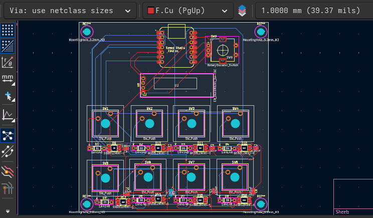
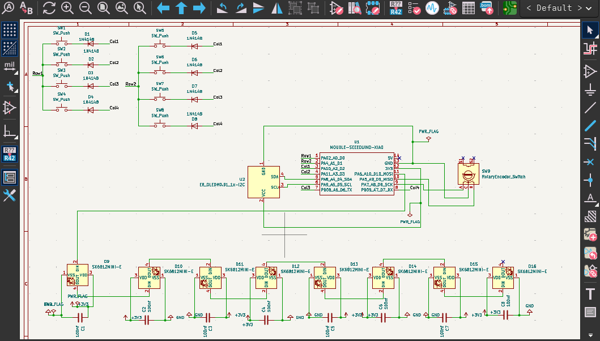

# CobraPad

A compact 2x4 macro pad built around the Seeed XIAO RP2040, designed to fit in a clean low-profile case with a rotary encoder, OLED display, and underglow LED strip.

This project keeps the KiCad PCB and case as the source of truth, with the firmware mapped directly to the actual board net names and pads.

## Overview

- MCU: Seeed XIAO RP2040
- Layout: 2 rows x 4 columns, 8 key matrix
- Extras: rotary encoder with push switch, SSD1306 OLED, eight SK6812MINI-E LEDs
- Firmware: CircuitPython
- Case: custom enclosure with top shell and bottom shell

## Photos

### Overall board

### Schematic

### PCB render

### Case fit

The final mechanical files are in [Case](Case) and include the top and bottom shell exports.

## Verified hardware mapping

The following pins are the actual board mapping used by the firmware in [Firmware/circuitpython/code.py](Firmware/circuitpython/code.py):

| Function | KiCad signal / board net | CircuitPython pin |
| --- | --- | --- |
| Row 1 | PA02_A0_D0 | D0 |
| Row 2 | PA4_A1_D1 | D1 |
| Col 1 | PA10_A2_D2 | D2 |
| Col 2 | PA11_A3_D3 | D3 |
| Col 3 | PB08_A6_D6_TX | D6 |
| Col 4 | PB09_A7_D7_RX | D7 |
| OLED SDA | PA8_A4_D4_SDA | D4 |
| OLED SCL | PA9_A5_D5_SCL | D5 |
| Encoder A | PA7_A8_D8_SCK | D8 |
| Encoder B | PA5_A9_D9_MISO | D9 |
| LED data | PA6_A10_D10_MOSI | D10 |

## BOM

| Part | Quantity | Notes |
| --- | ---: | --- |
| Seeed XIAO RP2040 | 1 | Main controller |
| SK6812MINI-E | 8 | LED strip / underglow |
| Mechanical key switches | 8 | Matrix keys |
| Diodes (1N4148 or equivalent) | 8 | One per switch |
| Rotary encoder | 1 | EC11-style encoder with switch |
| SSD1306 OLED 0.91" | 1 | 128x32 display |
| 3D-printed case parts | 1 set | Top and bottom shell |
| M2 screws / standoffs | 4+ | Case mounting |
| USB cable | 1 | Board programming and use |

## Repository layout

- [PCB/CobraPad](PCB/CobraPad) — KiCad source files for the board and schematic
- [kicad-libs](kicad-libs) — project-specific symbols and footprints
- [Firmware](Firmware) — CircuitPython firmware and setup notes
- [Case](Case) — FreeCAD source and exported case parts
- [assets](assets) — project screenshots and render images
- [production](production) — fabrication and submission outputs

## Production files

The final production artifacts are organized for the Hackpad submission flow:

- [production/gerbers.zip](production/gerbers.zip) — packaged PCB fabrication outputs
- [production/CobraPad.step](production/CobraPad.step) — board export
- [production/CobraPAD_CASE_FINAL_top_cover.step](production/CobraPAD_CASE_FINAL_top_cover.step) — case top panel
- [production/CobraPAD_CASE_Finalbottom_shell.step](production/CobraPAD_CASE_Finalbottom_shell.step) — case bottom shell
- [production/CobraPad_circuitpython.zip](production/CobraPad_circuitpython.zip) — firmware bundle

## Firmware

Firmware is in [Firmware/circuitpython/code.py](Firmware/circuitpython/code.py). Companion notes are in [Firmware/README.md](Firmware/README.md).

## Build notes

1. Open [PCB/CobraPad/CobraPad.kicad_pro](PCB/CobraPad/CobraPad.kicad_pro) in KiCad.
2. Verify the board matches the schematic and approved parts list.
3. Flash CircuitPython onto the XIAO RP2040.
4. Copy the contents of [Firmware/circuitpython](Firmware/circuitpython) onto the CIRCUITPY drive.
5. Assemble the PCB, case, encoder, and OLED.
6. Validate keyboard, encoder, LED, and display behavior.

## Physical validation checklist

The following still need to be confirmed on the assembled hardware:

- Matrix key presses register correctly on the host
- Encoder rotation direction is correct
- Encoder push button input functions as expected
- OLED powers on and displays the startup screen
- LED chain lights correctly
- USB enumeration works reliably
- Case fit is correct and no mechanical interference occurs

## Notes

- The PCB and case were treated as the source of truth for this project.
- No board redesign was performed during this pass.
- The firmware is intentionally tied to the real KiCad pin assignments so it matches the hardware exactly.

## License

This project is released under the MIT license. See [LICENSE](LICENSE).
