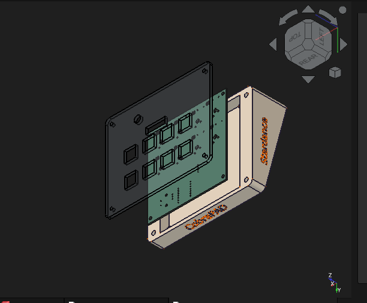

# CobraPad

CobraPad is a compact 8-key macro pad built around the Seeed XIAO RP2040, with a rotary encoder, SSD1306 OLED display, addressable RGB underglow, and a custom 3D-printed case. The board and case are treated as the source of truth, and the firmware is mapped directly to the actual KiCad net names and pad assignments.

## Overview

- MCU: Seeed XIAO RP2040
- Layout: 2 rows x 4 columns, 8-key matrix
- Extras: rotary encoder with push switch, 128x32 OLED, 8 SK6812MINI-E LEDs
- Firmware: CircuitPython
- PCB: 2-layer custom board, 99 mm x 99 mm
- Case: custom top and bottom enclosure designed for a fitted assembly

## Project photos

### Overall project / visible build

### Schematic

### PCB

### Case fit / enclosure

## Hardware summary

| Component | Quantity | Notes |
| --- | ---: | --- |
| Seeed XIAO RP2040 | 1 | Main controller |
| Mechanical switches | 8 | Key matrix |
| Diode (1N4148 or equivalent) | 8 | One per switch |
| Rotary encoder with switch | 1 | EC11-style encoder |
| SSD1306 128x32 OLED | 1 | I2C display |
| SK6812MINI-E RGB LEDs | 8 | Addressable LED chain |
| Decoupling capacitor | 3 | Power filtering |
| Resistor | 1 | Pull-up / support |
| 3D-printed case parts | 1 set | Top and bottom shell |
| M2 hardware | 4+ | Case assembly |

## Verified board pin mapping

The firmware in [Firmware/circuitpython/code.py](Firmware/circuitpython/code.py) is mapped to the board as follows:

| Function | KiCad signal / board net | CircuitPython pin |
| --- | --- | --- |
| Row 1 | PA02_A0_D0 | D0 |
| Row 2 | PA4_A1_D1 | D1 |
| Col 1 | PA10_A2_D2 | D2 |
| Col 2 | PA11_A3_D3 | D3 |
| Col 3 | PB08_A6_D6_TX | D6 |
| Col 4 | PB09_A7_D7_RX | D7 |
| OLED SDA | PA8_A4_D4_SDA | D4 |
| OLED SCL | PA9_A5_D5_SCL | D5 |
| Encoder A | PA7_A8_D8_SCK | D8 |
| Encoder B | PA5_A9_D9_MISO | D9 |
| LED data | PA6_A10_D10_MOSI | D10 |

## BOM

See [BOM.csv](BOM.csv) for the current project bill of materials.

## Repository layout

- [PCB/CobraPad](PCB/CobraPad) — KiCad PCB, schematic, and project files
- [kicad-libs](kicad-libs) — custom symbols and library files
- [CAD](CAD) — assembled CAD and mechanical source files
- [Case](Case) — case source and generated shell files
- [Firmware](Firmware) — CircuitPython firmware and notes
- [assets](assets) — project screenshots and render images
- [production](production) — manufacturing and production outputs
- [BOM.csv](BOM.csv) — project components list
- [LICENSE](LICENSE) — project license

## Production files

The final project includes fabrication and production artifacts in [production](production):

- [production/gerbers.zip](production/gerbers.zip) — PCB fabrication Gerbers and drill files
- [production/CobraPad.step](production/CobraPad.step) — PCB STEP export
- [production/CobraPAD_CASE_FINAL_top_cover.step](production/CobraPAD_CASE_FINAL_top_cover.step) — case top shell
- [production/CobraPAD_CASE_Finalbottom_shell.step](production/CobraPAD_CASE_Finalbottom_shell.step) — case bottom shell
- [production/CobraPad_circuitpython.zip](production/CobraPad_circuitpython.zip) — firmware bundle

## CAD and enclosure

The assembled CAD model is located in [CAD/CobraPAD_All together.step](CAD/CobraPAD_All%20together.step). This file represents the assembled project geometry and includes the designed enclosure plus the PCB in context. The project also includes the editable FreeCAD source file in [CAD/Final.FCStd](CAD/Final.FCStd).

## Firmware

The active firmware is written in CircuitPython and lives in [Firmware/circuitpython/code.py](Firmware/circuitpython/code.py). The companion notes are in [Firmware/README.md](Firmware/README.md).

### Firmware capabilities

- 8-key matrix scanning
- rotary encoder clockwise / counter-clockwise detection
- encoder push-button input
- SSD1306 display output
- 8-addressable RGB LED support
- USB HID keyboard output

## Build / setup notes

1. Open [PCB/CobraPad/CobraPad.kicad_pro](PCB/CobraPad/CobraPad.kicad_pro) in KiCad.
2. Verify the board matches the schematic and intended parts list.
3. Flash CircuitPython onto the XIAO RP2040.
4. Copy the contents of [Firmware/circuitpython](Firmware/circuitpython) onto the CIRCUITPY drive.
5. Assemble the PCB, case, encoder, OLED, and LEDs.
6. Validate key presses, encoder behavior, display output, and LED animation.

## Design notes

- The KiCad PCB and case files are the source of truth for this project.
- The board is intentionally mapped to the specific RP2040 pins used in the hardware.
- The firmware is designed to match the actual board connection map and component placement.
- The project is meant to be a compact, low-profile macro pad with a clean custom enclosure.

## Project status

This repository is prepared as a final project archive and submission bundle for the CobraPad macro pad. The current project includes the final PCB source, fabricated production outputs, custom case files, and the CircuitPython firmware.

## License

This project is released under the MIT license. See [LICENSE](LICENSE).
